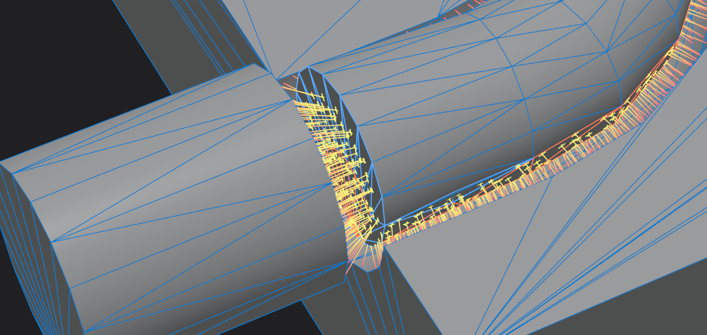

# HeatSpectra


This project allows the visualization of heat transfer between two or more 3D closed surface geometry. The simulation is deterministic, transient and operates in realtime using stable pre-processing methods. 


The major pre-processing methods include an intrinsic remeshing operation that preserves the shape of the geometry and a meshless restricted voronoi diagram step that discretizes the volume of the surface boundary.



This project is a work in progress. Functionality, performance and physical accuracy will be continuously updated.

## Quick Start
1. Download the latest demo release from the [Releases](https://github.com/tsun3doku/HeatSpectra/releases) page
2. Extract the zip file
3. Run HeatSpectra.exe

### Hardware Requirements
- GPU with Vulkan 1.3 or higher support ([Check GPU compatibility](https://vulkan.gpuinfo.org/))

### Prerequisites
- [CMake](https://cmake.org/download/) 
- [Qt 6](https://www.qt.io/download) (Core, Gui, Widgets components)
- [Vulkan SDK](https://vulkan.lunarg.com/) 1.3 or higher

### Build Steps

1. Clone the repository with submodules:
   ```bash
   git clone --recursive https://github.com/tsun3doku/HeatSpectra.git
   cd HeatSpectra
   ```

2. Configure and build:
   ```bash
   mkdir build && cd build
   cmake .. -DCMAKE_PREFIX_PATH="/YOURPATH/TO/Qt/6.x.x/msvc2022_64"
   cmake --build . --config Release
   ```

3. Run the program within build/release

